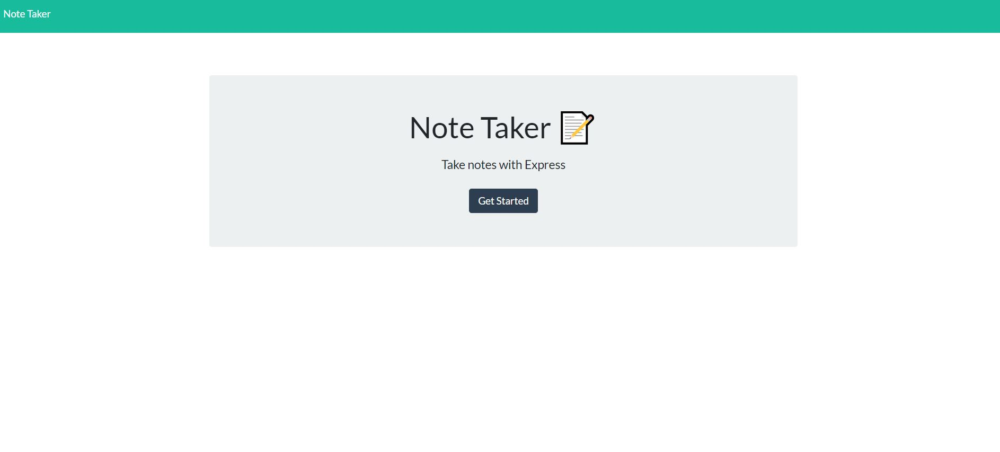
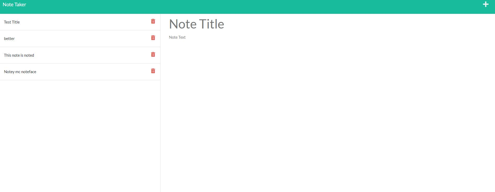

# Note Taker

## Description

This app allows users to write, save, recall (and possibly delete) notes.

## Table of Contents

- [Installation](#installation)
- [Usage](#usage)
- [Credits](#credits)
- [License](#license)

## Installation

N/A

## Usage

clicking the 'get started' button will take the user to the notes page where they will be able to write notes in the empty text areas provided, save notes by clicking the save button(save button only appears when text is entered into text area), and view previous notes by clicking their titles in the left hand column.

Deployed link: https://nameless-tundra-15651.herokuapp.com/

## Credits
Bryan Dalton

bryantdalton19@gmail.com

https://github.com/Bryandalton

## License

N/A
